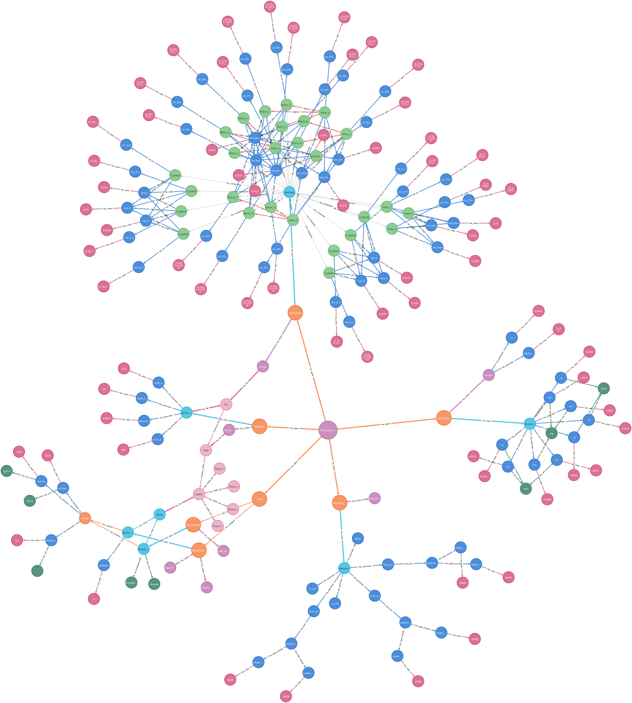

# Knowledge Graphs for digital twins of structural dynamic systems
A knowledge graph powered digital twin of structural dynamic systems. This consists of several components: mathmatical modelling (ODE), geometric modelling (python scripts for Blender), meshing (Gmsh), Finite Element Analysis (FEniCSx), and Bayesian inference of model parameters. The knowledge graph is built using Neo4j. These serve as "agents" and are containerised in Docker.

## Deployment Instruction
- Before running the project, make sure both the Docker and Docker Compose have been installed.

https://www.digitalocean.com/community/tutorials/how-to-install-and-use-docker-compose-on-ubuntu-20-04

- To run the DTOP system, first create a virtual environment in the main folder

For linux:
```bash
python3 -m venv env
```
- Then enter the environment

For linux:
```bash
source env/bin/activate
```
- Make sure you have Docker and Docker compose

- Run docker compose
```bash
sudo chmod 777 /var/run/docker.sock
docker compose build
docker compose up
```
- Then, in a web browser, go to http://localhost:7475/ (NOT 7474) to access the knowledge graph. Choose the Connect URL "neo4j://" and change "localhost:7687" to "localhost:7688".
Username: neo4j
Password: 12345678




